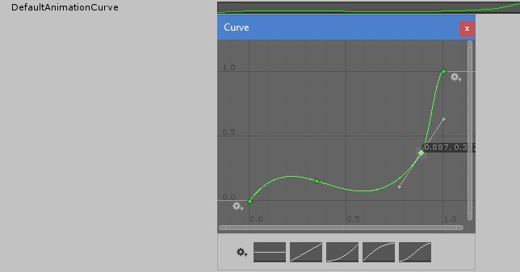
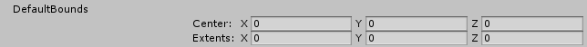
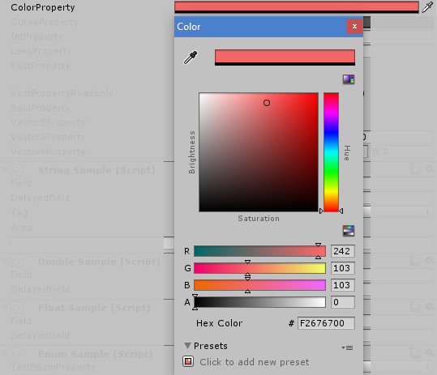
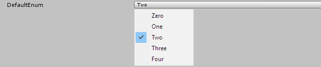
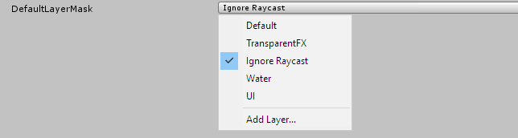
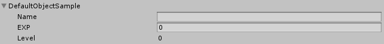
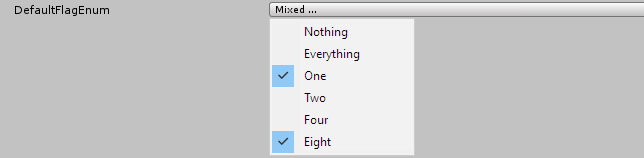

# Unity3D Inspector Reflector

<!--http://doctoc.herokuapp.com/-->
- [Introduction](#introduction)
	- [Drawbacks of Unity's default Inspector](#drawbacks-of-unitys-default-inspector)
- [Inspection with the IR](#inspection-with-the-ir)
	- [Enabling the IR](#enabling-the-ir)
	- [Default Inspection](#default-inspection)
	- [Customized Inspection](#customized-inspection)
	- [Extensability](#extensability)

## Introduction

Writing custom Inspectors is time consuming.<br>
When a type changes its custom inspector must be modified as well.
Stop wasting that time and start to spend it on more important tasks. Not only does the IR (Inspector Reflector) save us from spending our time on non-worthy tasks - it also solves many bugs that arouse with Unity's default Inspector.

### Drawbacks of Unity's default Inspector

Unity wants us to work with their Inspector in a very specific way which is rather cumbersome and error-prone. The fact that I have abandoned many of my Unity projects left my thinking. I came to the conclusion that the default Unity Inspector doesn't allow us to write code the way we want it to be. Unity therefore prevents us from writing in a truly expressive form, making me sort of angry, and often abandoning my projects in the end.<br>
<br>
Drawbacks:<br>
1) **Allowing exposure of private fields: The default Inspector forces us to expose fields which we often mark as private and are not meant to be part of the public contract.** Having a non-public field and exposing it by a property is often a good choice to control the setting and retrieval of a value. To display such a non-public field in the default Inspector a workaround must be put in place that displays the field (field must be marked with <code>SerializeFieldAttribute</code>). This causes the problem that the property's getter and setter won't be called and therefore Unity's <code>OnValidate()</code> callback must be used to trigger them manually. Because we cannot tell which values have changed when <code>OnValidate()</code> is called we must validate each value and for best results only trigger the properties whose values have changed.
   
2) **Disallowing exposure of public properties: There is no way to expose a property to the default Inspector.** The solution to the problem stated in (1) would be to allow the exposure of properties to the Inspector.<br>
   At this point there is no way of doing that without having to write a full custom inspector.
   
3) **Big workload for minor adjustments: Any modification to the default Inspector forces us to write a full custom Inspector.** Sometimes it would be beneficial to display some data in a more refined way. We may want to group some values and collapse them visually. Unity forces us to write a full custom Inspector even if we'd like to change just a small thing. A custom Inspector becomes handy if we want to completely change the appearance of the Inspector. Most of the time however we simply want to change the way a few  values are displayed and writing a full custom Inspector is definitely overkill.

Unity's default Inspector was designed in a way that the Inspector only shows serializable data. Properties do not match this criteria (only their backing fields are serializable). To decide wether this decision has more benefits than drawbacks is a conclusion you can make for yourself.
   
## Inspection with the IR

The IR follows two reasonable rules at all times:
- The IR must only be allowed to display the data that can also be read through code.
- The User must only be allowed to modify data that can also be modified through code.

The IR is an opt-in feature which means that Unity still defaults to their cumbersome Inspector after the IR is added to a project - which is good. Built in types and types from third-party providers should not be targeted by the IR. However, if a third-party type was designed with the IR in mind it won't function correctly before adding the IR to the project. 

### Enabling the IR

In order to enable the IR in your project you simply have to copy the *InspectorReflector* directory into your *Assets* directory. Classes marked with the <code>EnableIRAttribute</code> are then ready to be inspected.

```cs
[EnableIR]
public class Player : MonoBehaviour
{
```

Such a class' public instance fields and properties can be inspected if they are marked with the <code>InspectAttribute</code>. 

```cs
   [Inspect]
   public string Name;
   
   [Inspect]
   public int EXP
   {
      get
      {
         return _exp;
      }
      set
      {
         _exp = value;
         _level = Mathf.Floor(value / 100f);
      }
   }
   
   
   [Inspect]
   public int Level
   {
      get
      {
         return _level;
      }
   }
```

Note that Unity's serializer is only able to serialize private fields marked with the <code>SerializeFieldAttribute</code> as well as public fields. You therefore cannot use automatically implemented properties because the invisible private backing field wouldn't be marked with the <code>SerializeFieldAttribute</code>. The solution is to create the backing field yourself like this:

```cs
   [SerializeField]
   private int _exp;

   [SerializeField]
   private int _level;
}
```

It is crucial to know that data can only survive a loading process if it can be serialized. Unity has some other restrictions on what kinds of data can be serialized. Before using the IR you should understand all those restrictions:<br>
https://blogs.unity3d.com/2014/06/24/serialization-in-unity/

### Default Inspection

By marking a public field or property with the <code>InspectAttribute</code> you instruct the IR to use default inspection. What follows is a table showcasing the behaviour of the default inspecton on all built-in types. By copying the *Sample* directory into your *Assets* directory you can experience the IR yourself.

| Type               | Visual Result                                                    | 
|:-------------------|:-----------------------------------------------------------------|
| AnimationCurve     |    |
| bool               |                        |
| byte               |                        |
| Bounds             |                    |
| char               |                        |
| Color              |                      |
| double             |                    |
| Enum               |                        |
| float              |                      |
| int                |                          |
| LayerMask          |              |
| long               |                        |
| Rect               |                        |
| sbyte              |                      |
| short              |                      |
| string             |                    |
| uint               |                      |
| ulong              |                      |
| ushort             |                    |
| Vector2            |                  |
| Vector3            |                  |
| Vector4            |                  |

Reference-types that were not mentioned above are displayed using a collapsable foldout. If the foldout is expanded the reference's inspectable members are displayed the same way as member of the actual type you are inspecting:<br>



There are some special scenarios where the IR displays your data differently:

| Special scenario   | Visual Result                                                           | 
|:-------------------|:------------------------------------------------------------------------|
| Readonly&nbsp;Property  | The value displayed when inspecting a readonly property, a readonly field or a const field is the <code>string</code> returned by the instance's <code>ToString()</code>:<br>         |
| Enum (Flags)       | You are allowed to select multiple values if the enum type is marked with the <code>FlagsAttribute</code>:<br>                  |

The visuals of the IR's default inspection are in most cases exactly the same as you would expect them from Unity's default Inspector. In the next chapter we are looking at ways to customize what the IR displays with almost zero efford. 

### Customized Inspection

Coming soon

### Extensability

Coming soon
